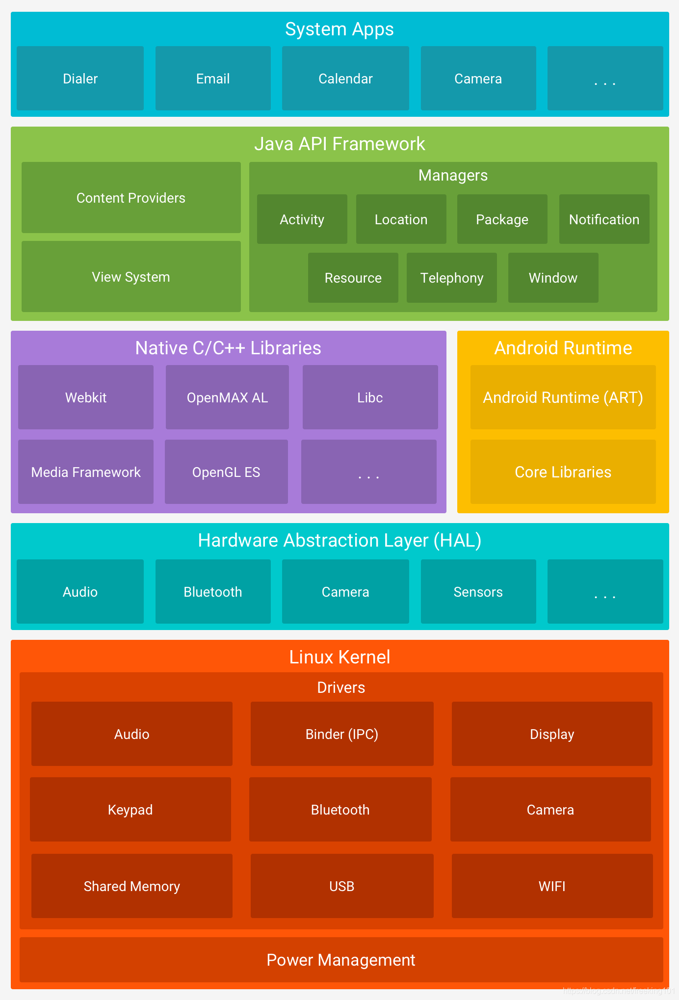
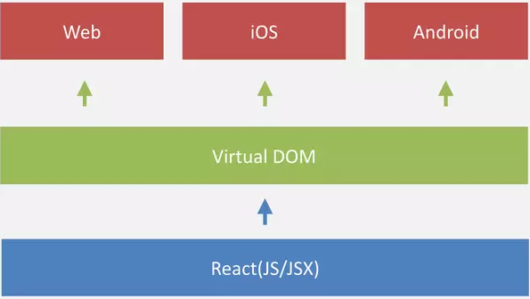

# Mobile App development

## 移动领域
#### 移动手持设备
- 早期移动设备主要以PAD为主，开发后，只能做单一用途，价格贵，成本高，功能单一。
- 非智能手机以诺基亚（Nokia）为主，系统Symbian OS,用户通过WAP浏览器获取信息，无法形成具备一定规模的企业级应用。
- 第三代智能手机以及平板电脑的出现，促使移动领域进入了移动互联的时代。
#### 智能移动设备
- phone
  - ios huawei xiaomi meizu 1+ oppo vivo samsung lG moto
- pad
- Wear
- TV
- 车载系统
- 智能家具
#### 移动手持设备体验
- 屏幕较小
- 输入不便
- 操作性差
- 网速/费用
- 平台不统一
#### 移动应用未来
- 万物互联
#### 移动互联网

---

## 移动应用开发技术
#### Native app
##### Android

- 应用层
  - Android 装配了一个核心应用程序集合，包括 E-mail 客户端、SMS 短消息程序、日历、地图、浏览器、联系人管理程序和其他程序，所有应用程序都是用 Java 编程语言编写的。
  - 用户开发的 Android 应用程序和 Android 的核心应用程序是同一层次的，它们都是基于 Android 的系统 API 构建的。
- 应用程序框架层
  <table><tbody><tr><th style="width:100px;">系统/服务</th><th style="width:66px;">英文名称</th><th>说明</th></tr><tr><td style="width:100px;">视图</td><td style="width:66px;">View</td><td>这里的视图指的是丰富的、可扩展的视图集合&#xff0c;可用于构建一个应用程序&#xff0c;包括列表 (Lists)、网格 (Grids)、文本框 (TextBoxes)、按钮 (Buttons)&#xff0c;甚至是内嵌的 Web 浏览器。</td></tr><tr><td style="width:100px;">内容管理器</td><td style="width:66px;">Content Provider</td><td>内容管理器使得应用程序可以访问另一个应用程序的数据&#xff08;如联系人数据库&#xff09;或者共享自己的数据。</td></tr><tr><td style="width:100px;">资源管理器</td><td style="width:66px;">Resource Manager</td><td>资源管理器提供访问非代码资源&#xff0c;如本地字符串、图形和分层文件 (layout files)。</td></tr><tr><td style="width:100px;">通知管理器</td><td style="width:66px;">Notification Manager</td><td>通知管理器使得所有的应用程序都能够在状态栏显示通知信息。</td></tr><tr><td style="width:100px;">活动管理器</td><td style="width:66px;">Activity  Manager</td><td>在大多数情况下&#xff0c;每个 Android 应用程序都运行在自己的 Linux 进程中。当应用程序的某些代码需要运行时&#xff0c;这个进程就被创建并一直运行下去&#xff0c;直到系统认为该进程不再有用为止&#xff0c;然后系统将回收该进程占用的内存以便分配给其他的应用程序。活动管理器管理应用程序生命周期&#xff0c;并且提供通用的导航回退功能。</td></tr></tbody></table>

  - 应用程序的体系结构旨在简化组件的重用，任何应用程序都能发布它的功能且任何其他应用程序都可以使用这些功能（需要服从框架执行的安全限制），这一机制允许用户替换组件。
  - 开发者完全可以访问核心应用程序所使用的 API 框架。通过提供开放的开发平台，Android 使开发者能够编制极其丰富和新颖的应用程序。开发者可以自由地利用设备硬件优势访问位置信息、运行后台服务、设置闹钟、向状态栏添加通知等。
- 系统库
  <table><tbody><tr><th>名称</th><th>说明</th></tr><tr><td>系统C语言库</td><td>标准C语言系统库 (libc) 的 BSD 衍生&#xff0c;调整为基于嵌入式 Linux 设备。</td></tr><tr><td>媒体库</td><td>基于 PacketVideo 的 OpenCORE&#xff0c;这些库支持播放和录制许多流行的音频和视频格式&#xff0c;以及静态图像文件&#xff0c;包括 MPEG4、H.264、MP3、AAC、AMR、JPG、PNG。</td></tr><tr><td>界面管理</td><td>管理访问显示子系统&#xff0c;并且为多个应用程序提供 2D 和 3D 图层的无缝融合。</td></tr><tr><td>LibWebCore </td><td>新式的 Web 浏览器引擎&#xff0c;支持 Android 浏览器和内嵌的 Web 视图。</td></tr><tr><td>SGL</td><td>一个内置的 2D 图形引擎。</td></tr><tr><td>3D 库</td><td>基于 OpenGL ES 1.0 APIs 实现&#xff0c;该库可以使用硬件 3D 加速或包含高度优化的 3D 软件光栅。</td></tr><tr><td>FreeType</td><td>位图和矢量字体显示渲染。</td></tr><tr><td>SQLite</td><td>SQLite 是一个所有应用程序都可以使用的强大且轻量级的关系数据库引擎。</td></tr></tbody></table>
  
  - Android本地框架是由 C/C++ 实现的，包含 C/C++ 库，以供 Android 系统的各个组件使用。这些功能通过 Android 的应用程序框架为开发者提供服务。
- Android 运行环境
  - Android 包含一个核心库的集合，该核心库提供了 Java 编程语言核心库的大多数功能。
  - Android虚拟机Dalvik和ART
    - Dalvik 虚拟机
      - Dalvik虚拟机是Google自己设计的用于Android平台的虚拟机，它曾经是Android平台的核心组成部分之一。它负责加载dex/odex文件并解析成机器码然后执行。Dalvik虚拟机并没有遵循《Java虚拟机规范》,因此不能算是Java虚拟机。但是它与Java却又有联系，它执行的DEX文件是通过Class文件转化而来。我们也可以认为它是为了能在安卓设备运行而对JVM进行优化的产物。
      - Dalvik诞生消亡史
        - Android 1.0，使用Dalvik作为Android虚拟机运行环境。
        - Android 2.2，Google在Andriod虚拟机中加入了JIT编译器（Just-In-Time Compiler）。
        - Android 4.4，Google带来了全新的虚拟机运行环境ART，此时ART和Dalvik是共存的，用户可以在两者之间进行选择。
        - Android 5.0，ART全面取代了Dalvik成为了Android虚拟机运行环境，至此Dalvik退出历史舞台。
      - Dalvik 特点 （与JVM的区别）
        - Dalvik虚拟机运行的是Dalvik字节码，Dalvik字节码由Java字节码转换而来，并被打包到一个dex文件中。而JVM运行的是class文件或jar文件。
        - 加载速度快，dex相比于Jar文件会把所有包含的信息整合在一起，减少了冗余信息。这样就减少I/O操作，提高类的查找速度。
        - Dalvik虚拟机是基于寄存器，而JVM是基于栈（操作数栈）。虽然基于寄存器执行效率好，但是可移植性差，难跨平台。
        - Dalvik虚拟机允许在有限的内存中同时运行多个进程，每一个应用都运行在一个Dalvik虚拟机实例中，拥有独立的进程空间。
        - Dalvik虚拟机有共享机制，不同应用之间在运行时可以共享相同的类，拥有更高的效率。
    - JIT（Just-In-Time Compiler）
      - 早期没有JIT的时候，虚拟机运行时，会通过解释器来解释字节码并将其翻译为机器码，逐条读入，逐条翻译，最后再执行，这样就比较慢，效率不高。针对上面这个问题，引进了JIT（即时编译器）技术。它是一种优化手段。
      - JIT技术简单来说就是将解释过的机器码缓存起来，下次再执行时到这个方法的时候，则直接从缓存里面取出机器码来执行。减少了读取字节码和翻译字节码的操作。以此来提高效率。JIT技术的引入使得Dalvik的性能提升了3~6倍
      - 不过要注意的是并不是所有执行过的代码对应的机器码都会被缓存起来。而是只有被认定为热点代码（Hot Spot Code） 的代码才会。这里所指的热点代码主要有两类，包括：
        - 被多次调用的方法
        - 被多次执行的循环体（虽然只是循环体被多次执行，但仍是将整个方法的机器码缓存起来）
      - JIT技术虽好，但是也是有缺点的：
        - 每次重新启动引用都需要重新编译
        - 运行时比较耗电
    - Dex
        
      - dex是二进制文件，用于在Android虚拟机上执行。是通过把所有的class文件进行合并优化得到的。dex文件去除了class文件中的冗余信息（比如重复字符串），并且结构更加紧凑，因此在dex解析阶段可以减少I/O操作，提高类查找速度。
      - 与.jar文件不同，.jar文件像是一个文件夹，里面的.class是单独的文件，各个class信息里面会出现重复的信息。而dex文件，则将所有的.class里面的信息整合在一起，去除掉里面的重复数据。
    - ART 虚拟机
      - ART虚拟机在Android 5.0开始替换Dalvik虚拟机。其处理应用程序执行的方式不同于Dalvik虚拟机，它不使用JIT而是使用了AOT（Ahead-Of-Time），也就是提前编译技术。并且对垃圾收集器也进行了改进和优化，当然也还包括了其他的优化。
      - AOT（Ahead-Of-Time)
        - AOT也就是提前编译技术。简单来说就是提前将字节码转换成本地机器码，然后存储在本地磁盘上，运行时可以直接执行，避免了Dalvik时期的应用运行时再来解释字节码。运行时效率大大提高。
        - 在Android 7.0 之前，Android系统安装应用的时候，会进行一次预编译，将字节码预先编译成本地机器码，生成.oat文件，并存储在本地磁盘上，也就是AOT技术。这样在应用每次运行时就不需要重新编译，可以直接使用编译好本地机器码，运行效率大大提升。但是这也使得安装应用的时间大大增加，
        - 于是在Android7.0，又重新引进了JIT技术，形成JIT/AOT混合编译模式，这种混合编译的特点是：
        - 应用在安装的时候，不进行AOT预编译。
        - 应用运行时这直接通过解释器翻译字节码为机器码然后执行。并同时记录热点代码信息到profile文件中。
        - 手机进入空闲或充电状态的时候，系统会扫描APP目录下的profile文件，并通过AOT对热点代码进行编译。
        - 下一次启动时，会根据profile文件来运行已编译好的机器码，避免在运行时对已经变过的方法又进行了JIT编译。
        - 应用运行期间会持续对热点代码进行记录，以方便在空闲或充电时进行AOT，以此循环。
    - Dalvik VM 和 ART VM 有什么区别
      - ART早期使用AOT技术，后期使用AOT+JIT混合，而Dalvik使用JIT
      - ART支持64位CPU并兼容32位CPU,而Dalvik只支持32位CPU
      - ART对垃圾收集器进行了改进优化，提高了吞吐量。
  
##### IOS
 
 

- iOS的系统架构主要由Application Layer（应用层）、Cocoa Touch Layer（触摸层）、Media Layer （媒体层）、Core Services Layer（核心服务层）、Core OS Layer （核心系统操作层）和The Kernel and Device Drivers layer（内核和驱动层）。
- Cocoa Touch Layer：触摸层提供应用基础的关键技术支持和应用的外观。如NotificationCenter的本地通知和远程推送服务，iAd广告框架，GameKit游戏工具框架，消息UI框架，图片UI框架，地图框架，连接手表框架，UIKit框架、自动适配等等
- Media Layer：媒体层提供应用中视听方面的技术，如图形图像相关的CoreGraphics,CoreImage,GLKit,OpenGL ES,CoreText,ImageIO等等。声音技术相关的CoreAudio,OpenAL,AVFoundation,视频相关的CoreMedia,Media Player框架，音视频传输的AirPlay框架等等
- Core Services Layer：系统服务层提供给应用所需要的基础的系统服务。如Accounts账户框架，广告框架，数据存储框架，网络连接框架，地理位置框架，运动框架等等。这些服务中的最核心的是CoreFoundation和Foundation框架，定义了所有应用使用的数据类型。CoreFoundation是基于C的一组接口，Foundation是对CoreFoundation的OC封装
- Core OS Layer：系统核心层包含大多数低级别接近硬件的功能，它所包含的框架常常被其它框架所使用。Accelerate框架包含数字信号，线性代数，图像处理的接口。针对所有的iOS设备硬件之间的差异做优化，保证写一次代码在所有iOS设备上高效运行。CoreBluetooth框架利用蓝牙和外设交互，包括扫描连接蓝牙设备，保存连接状态，断开连接，获取外设的数据或者给外设传输数据等等。Security框架提供管理证书，公钥和私钥信任策略，keychain,hash认证数字签名等等与安全相关的解决方案。
##### winPhone
#### Web app
- Web App是指基于Web的应用，运行于网络和标准浏览器上，相当于一个网页然后加一个App的壳。2014年HTML5的标准规范制定完成，在网络舆论上Web App大有取代Native App的气势，但Web App有以下缺点，使得它始终是“主角的心，配角的命” ：
- 性能低，操作体验不好
- 无法调用原生API，很多功能无法实现
- 依赖于网络，网速慢时体验很差，并且没有离线功能，优化不好的话会消耗流量
- 只能做为一个临时的入口，用户留存率低
#### Hybrid App
- 除了采用原生和Web开发App，还可以采用HTML5+原生来进行混合开发，这就是Hybrid。关于Hybrid的诞生有一个小故事：某个二线互联网公司的App是以原生为主，HTML5开发打酱油，随着应用越来越复杂，终于有一天发现原生有一个方法最大数限制，一些页面需要内嵌HTML5的页面，于是原生和HTML5团队一起做了第一个Hybrid项目，这一套代码兼容三端并且效率很高，因此Hybrid App就成了这个公司的主流，业界其他的公司也都纷纷效仿。
- Hybrid App的原生UI组件用来展示交互复杂和渲染要求高的界面,其他的可以交给HTML5来展示。
- Hybrid App虽然开发效率高，可以跨平台，但是Hybrid体验比不上原生，对于需要快速试错、快速占领市场的团队来说，Hybrid App是一个不错的选择，后期团队稳定下来后，最好还是要做体验更好的原生APP或者使用其他体验更好的跨平台技术。
- Hybrid相关的技术有很多，比如PhoneGap、Cordova、Ionic、VasSonic等等
  - PhoneGap
    - PhoneGap面向Web开发人员，通过使用HTML、CSS和JavaScript构建跨平台App
  - Cordova
    
    - 2011年，Apache收购了Nitobi Software和它的PhoneGap产品，并对PhoneGap进行开源，PhoneGap 2.0版本时，产品更名为Apache Cordova。目前Cordova支持的平台有Android、iOS、Windows、Mac OS X、Electron。Cordova的体系结构图如下所示：
    - Cordova同样使用WebView来展示界面，插件是Cordova中不可或缺的一部分，Apache Cordova维护了名为Core Plugins的插件，这些核心插件为App提供访问设备功能，如电池、相机、联系人等。除了核心插件之外，还有一些第三方插件可以使用，你也可以开发一个自己的插件。
  - Ionic
    - Ionic Framework是一个开源UI工具包，最早的目标是使用HTML、CSS和JavaScript等Web技术开发移动应用程序。由于Web技术的这一基础，Ionic可以在网络运行的任何地方运行，比如 iOS、Android、浏览器、Electron、PWA等等。目前，Ionic Framework已与Angular正式集成，但对Vue和React的支持正在开发中。
  - VasSonic
    - VasSonic是由腾讯VAS团队开发的轻量级高性能混合框架，旨在加速在Android和iOS平台上运行的H5首屏。VasSonic不仅支持服务器呈现的静态或动态网站，而且还完美兼容Web离线资源。VasSonic使用自定义的URL连接而不是原始网络连接来请求索引HTML，因此它可以提前或并行请求资源以避免等待视图初始化。在这种并行的情况下，VasSonic可以通过WebKit或Blink内核读取和呈现部分数据，而无需花费太多时间等待数据流的结束。
  - 微信小程序
    - 微信小程序的主要开发语言是 JavaScript ，小程序的开发同普通的网页开发相比有很大的相似性。小程序的运行环境分成渲染层和逻辑层，这两层分别由2个线程管理，渲染层的界面使用了WebView 进行渲染，逻辑层采用JSCore线程运行JS脚本。这两个线程的通信会经由微信客户端（Native）中的JSBridage做中转。逻辑层发送网络请求也经由Native转发，小程序的通信模型下图所示:
    
    - 微信小程序和PWA都是基于Web技术，原理的区别是小程序类似Hybrid架构，WebView渲染基本的网页内容，对渲染性能要求较高的组件，通过原生组件来实现，比如相机、视频、地图等等，另外传统Web无法访问的本地能力，需要通过JS SDK来实现，而PWA则是使用多种技术增强Web能力，以达到接近Native应用的体验。
    - 微信小程序本身和App就不是竞争关系，更多的是一个推广渠道，它更像是一张海报，用于快速推广倒流，而App则是要推广的对象。
    - 微信小程序的缺点很明显，体验上无法跟App相提并论，功能依托并受限于微信，无法进行拓展。可以说微信小程序就是建立了次级生态，这个生态中微信说的算，其他对手的发展会受到威胁。
          
#### 语言编译转换
- 语言编译转换指的是直接将某个语言编译为一个平台下的二进制文件。比较有名的是Xamarin框架，虽然它在 Android平台是内嵌了Mono虚拟机来实现的，但在 iOS平台下是以AOT 的方式编译为二进制文件的，所以把它归到语言编译转换类型。
  - Xamarin
#### 原生渲染
原生渲染在本篇文章中指的是由JavaScript开发并且由原生控件渲染，代表有React Native、Weex、快应用。
- *React Native
  
  - React Native是Facebook早先开源的 Web UI框架React在原生移动应用平台的衍生产物，底层对Android和iOS平台的原生代码进行封装，通过使用JavaScript就可以编写出原生代码。
  - Virtual DOM是DOM在内存中的一种轻量级表达方式，可以通过不同的渲染引擎生成不同平台下的UI。
  - React Native与原生框架通过Bridge进行通信.
- Weex
  
  - Weex 是阿里开源的一款跨平台移动开发工具，它能够完美兼顾性能与动态性，让移动开发者通过简捷的前端语法写出原生级别的性能体验，并支持iOS、Android、YunOS及Web等多端部署。
  - Weex首先将编写的Weex源码，通过transformer转换成JS Bundle。然后将JS Bundle部署在服务器，当接收到终端（Android、Web端、iOS端）的JS Bundle请求时，将JS Bundle下发给终端。
  - 在终端中，由Weex的JS Framework 接收和执行JS Bundle代码，并且执行数据绑定、模板编译等操作，然后输出JSON 格式的 Virtual DOM，JS Framework发送渲染指令给Native ，提供 callNative 和 callJS 接口，方便 JS Framework 和 Native 的通信。
- 快应用
  
  - 2018年3月份，由华米OV等10家国内主流厂商成立了快应用联盟。快应用介于移动网页和原生应用之间，第三方应用以移动网页的形式进行开发，最终得到原生渲染的效果体验
  - 快应用框架深度集成进各手机厂商的手机操作系统中，可以在操作系统层面形成用户需求与应用服务的无缝连接，很多只用在原生应用中才能使用的功能，在快应用中可以很方便的实现，享受原生应用体验，同时不用担心分发留存等问题，资源消耗也比较少。
  - 对于每台手机设备，应用可以从多个系统入口，引用用户体验产品。与React Native和Weex相比主要有两点不同：
    - 快应用自身不支持Vue或React语法，它采用的是JavaScript开发。
    - React Native和Weex的渲染引擎是集成到框架中的，每一个App都需要打包一份，安装包体积较大，快应用渲染引擎是集成到ROM中的，应用中无需打包，安装包体积小。
    - 和微信小程序很像，快应用本质上也是要建立次级生态。
    - 快应用实现划分为编译时、运行时两个方面，UX页面源码经过编译时得到JS，然后经过运行时得到界面UI。每一个页面由HTML+CSS+JS组成，编译运行后得到内存中的DOM树。多个页面组成一个项目，编译后得到rpk文件，最终运行时以应用形态呈现。
#### 自绘UI
- 自绘UI指的是通过在不同平台实现一个统一接口的渲染引擎来绘制UI，而不依赖系统平台的原生控件，这样做可以保证不同平台UI的一致性。不用像React Native一样，随着不同平台系统版本的变化，开发者还需要处理不同平台的差异，甚至有些特性只能在单个平台上实现，这样无法保证不同平台UI的一致性。自绘UI框架的代表有Qt和Flutter。
- Flutter
  
  - Flutter是谷歌的移动UI框架，可以快速在Android和iOS上构建高质量的原生用户界面， 它的前身是谷歌试验项目Sky。
  - Futter提出了一切皆为控件（Widget）的概念，除了基本的文本、图片、卡片、输入框等Widget，布局方式和动画等也都是Widget。通过使用不同类型的Widget，就可以实现复杂度的界面。  
  - Flutter框架采用了分层设计，此设计的目标是帮助开发者使用更少的代码完成更多工作。例如，Material层是由Widgets层的普通Widget组成的，而Widgets层本身是通过来自Rendering层的低级对象构建的。

---

## 移动应用安全
#### 移动应用攻击的新特点
- 设备端欺诈
- 电话呼叫重定向
- 窃取通知直接回复功能
- 通过域生成算法规避检测
- 绕过应用程序商店审查
  DGA(Domain Generation Algorithm，域名生成算法)是一种传统恶意软件经常使用的算法，可定期生成大量域名，让C&C服务器更加隐蔽，降低攻击发现几率，增强僵尸网络的鲁棒性。
- 恶意软件功能模块化、流程化
  虽然采用模块化方式设计恶意软件已较为常见，但现在发现的移动APP恶意程序开始有体系化的功能更新流程，比如近期发现的Xenomorph恶意软件通过结合模块化设计、可访问性引擎、基础架构优化和C2协议，已能够实现流程化的功能更新和版本迭代，使其危害性和攻击能力更快速地增长，包括自动传输系统(ATS)功能的实现。将来，更多的移动恶意软件家族会通过更完整的更新模式和流程，在受感染的移动设备上不断启用全新的攻击功能。 
#### 移动应用安全防护
- 移动应用攻击正在成为网络犯罪活动的主战场。大多数移动应用安全事件是由系统漏洞、不安全的编码实践，以及缺乏足够的安全测试能力造成的。为了应对这些新的移动应用攻击手法，企业需要确保其网络安全计划中包含了全面的防御手段，包括移动设备管理解决方案、多因素身份验证以及有效的员工访问控制等。此外，企业安全团队需要在移动业务开发生命周期中加强对应用的测试，更快地发现漏洞，同时监控部署的所有移动应用，以降低发生重大移动应用安全事件的几率。企业可以通过动态移动应用安全测试、对移动开发人员的更好培训以及更加重视移动应用安全来避免发生这类事件。

---

## 移动应用测试
#### Unit Tests
- Unit tests cover the smallest parts of code, like individual functions or classes.
#### Integration Tests
- Real individual units are combined and tested together to ensure that their cooperation works as expected.
#### End-to-End
- Cucumber + Appium 

- Cucumber 一个实现BDD(Behavior-driven development)的框架。Cucumber为了良好的抽象软件行为，定义了一套DSL：Gherkin。使用Gherkin，我们可以将繁杂的自动化脚本进行拆分：将复杂的操作脚本沉淀为下层util，只暴露上层的自然语言的行为描述给开发者，大大降低脚本编写的门槛和成本。
- Appium总体是一个C/S结构，即Appium Server和Appium Client。Appium Server是一个暴露一系列API的Node Server(npm install -g appium)，它以HTTP Response的形式响应来自Appium Client的不同请求。Appium Client本质就是一个HTTP Request发送器，它封装了一系列API来方便的发送各种UI操作请求。Appium的这种设计优点在于Client可以被灵活的选择，不管用何种语言，何种方式，只要能够发送符合协议的HTTP Request就可以充当Appium Client。
  
#### 性能测试 (android)
- 启动时间：启动APP所需时间
  - 应用冷启动<=600ms为优秀，<=800ms为良好，<=1000ms为可接受；
  - 应用热启动<=200ms为优秀，<=400ms为良好，<=600ms为可接受；
  - cmd 
    - adb shell dumpsys activity | grep "app.package"
    - adb shell am start -W –S –n <activity> 获取应用首次启动时间
    - adb shell am start –W –n <activity> 获取应用二次启动时间
- 流畅度：也称为帧率FPS，指画面每秒传输帧数；帧率越大，页面越流畅。
- 过渡绘制：过度绘制描述的是屏幕上的某个像素在同一帧的时间内被绘制了多次。
- 内存：占用系统内存的大小
  - 操作单次申请pss内存超过50M需查看是否合理，java堆内存单次操作申请内存不超过20M；
  - 不存在内存抖动问题，频繁GC；
  - 不存在内存持续增长问题，内存泄漏；
  - 不存在一段时间内存持续增长后无法释放问题，如位图未释放或重复缓存；
  - 返回mainActivity后不存在其他Activity实例；
  - hprof（内存快照），只可分析java层泄漏
  - check 场景
    - 空闲状态下的应用内存消耗情况（程序运行后按home键挂后台）
    - 中等规格状态下的应用内存消耗情况（注意查看是否申请的内存过大）
    - 满规格状态下的应用内存消耗情况
    - 针对性的场景测试,较容易出现内存泄漏的部分场景：
      - activity间的切换，只要非静态的匿名类对象没有被回收，MainActivity就不会被回收，MainActivity所关联的资源和视图都不会被回收，发生比较严重的内存泄漏。
      - 连续查看和发送大图片，不断反复观看返回继续观看等操作，都有可能因为和之前的内存资源没释放而导致内存不断增长。
      - 有执行异步线程的场景后如果未给线程进行结束，会引起内存泄漏，因为activity的结束销毁不会把正在运行的thraead也结束回收掉。比如后台下载或加载东西时关闭activity。
      - 在activity关闭时Handler还没结束，会到导致内存泄漏。例如一些界面UI还在刷新时关闭activity。
      - 从登录界面登录账号后，登录界面的activity只是退到后台或是被登录后的activity覆盖，像这种过渡界面的acticity容易出现未去摧毁而出现内存泄漏。
  - cmd
    - adb shell dumpsys meminfo "app.package"
- CPU：对系统CPU的占用率
  - 静态不超过5%，后台静默不超过1%，一般运行状态不超过30%，高负荷运行不超过75%，峰值不超过90%；
  - check 场景
    - 空闲状态下的应用CPU消耗情况（程序运行后按home键挂后台）
    - 中等规格状态下的应用CPU消耗情况（程序执行普通操作时的cpu占用）
    - 中等规格状态下长时间的应用CPU消耗情况
    - 满规格状态下的应用CPU消耗情况
    - 针对性的场景测试
  - cmd
    - adb shell top -d 1 | grep "app.package" (每隔1s获取对应app的cpu占用)
    - adb shell dumpsys cpuinfo | grep "app.package" （cpu 占用的具体描述）
- 流量：流量消耗
